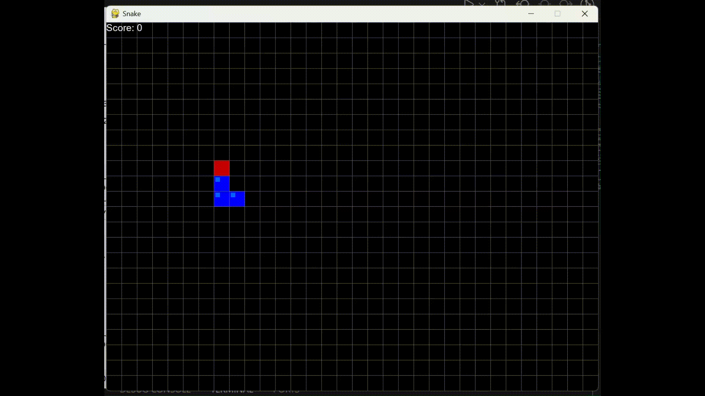
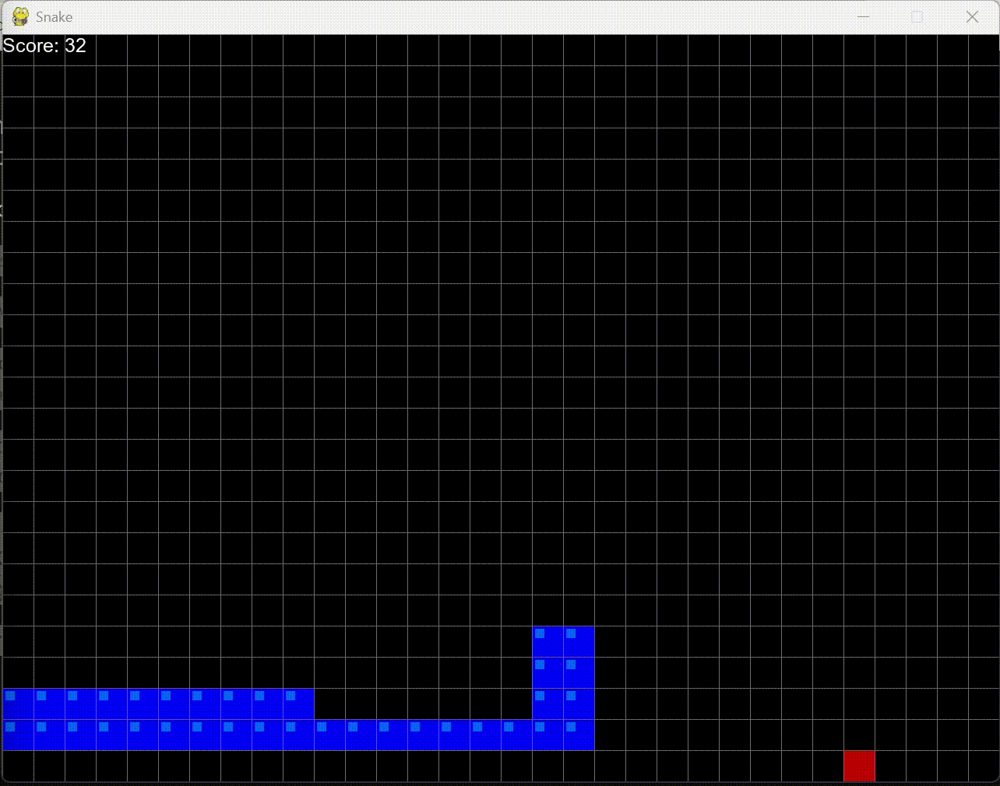
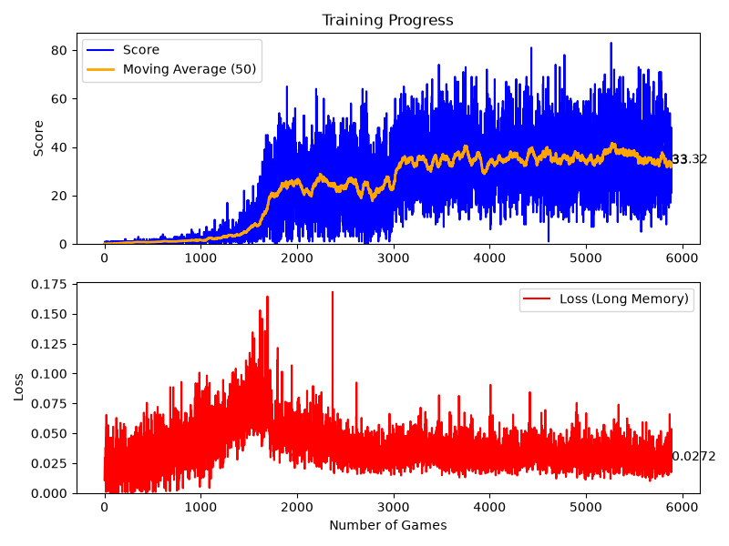
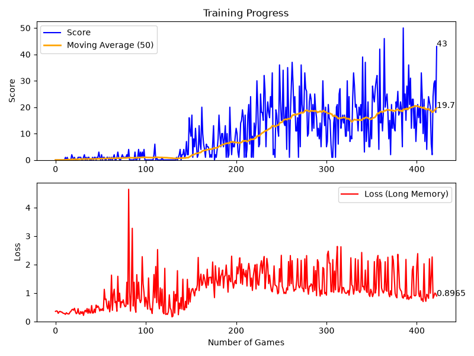

# Reinforcement Learning Snake Game

<div align="center">
  <!-- Placeholders for your gameplay videos/GIFs -->
  
  
  <br>
  <em>Left: V2 Hybrid Agent demonstrating long-term spatial planning. Right: V1 Baseline exhibiting short-sighted, reactive behavior.</em>
</div>

## 📌 Project Overview
This project focuses on the development, architectural scaling, and optimization of an autonomous Reinforcement Learning (RL) agent trained to master the classic game of Snake. 

The primary objective was to push beyond the rigid performance plateau of a standard tabular/linear Deep Q-Network (DQN). By transitioning from a localized, parameter-based state representation to a comprehensive **Dual-Input Hybrid CNN architecture**, the agent was successfully cured of its inherent "spatial blindness," unlocking profound pathfinding capabilities and strategic depth.

---

## 🧠 Architecture & Technical Deep Dive

To shatter the performance ceiling of the baseline model, the state representation and network architecture were completely redesigned. The final V2 agent utilizes a **Late Fusion** approach, combining spatial computer vision with hard-coded logical reflexes.

### 1. Dual State Representation
The model receives two distinct inputs simultaneously:
* **Visual State (3D Tensor):** A 3-channel matrix providing a comprehensive global view of the board:
    * `Channel 1`: Pinpoints the snake's head (Binary 1/0).
    * `Channel 2`: Maps all physical obstacles, including the snake's growing body and the walls (Binary 1/0).
    * `Channel 3`: A continuous spatial heatmap representing the Manhattan distance to the food, acting as a navigational gradient.
* **Logical State (1D Vector):** A 12-parameter absolute vector serving as a hard-logic anchor. It provides explicit, immediate data on absolute dangers (Up, Down, Left, Right), current movement direction, and absolute food location.

### 2. Network Topology (CNN + Late Fusion)
Due to the immense spatial complexity of the environment, the network was scaled significantly:
* **Feature Extraction:** The visual input passes through a Deep Convolutional Neural Network (CNN). We strategically utilize `MaxPool` and `Dropout` layers to extract complex geometric patterns (e.g., the shape of the tail) while preventing overfitting to specific board states.
* **Late Fusion:** The visual data is compressed into a dense feature vector and concatenated with the 12 logical parameters just before the final Fully Connected layers. This synchronizes long-term visual pathfinding with immediate logical survival instincts.
* **Action Space:** The model outputs one of 4 absolute discrete actions: `[Up, Down, Left, Right]`.

### 3. Training Paradigm
* **Algorithm:** Deep Q-Learning optimized with `Adam` and a Mean Squared Error (`MSELoss`) function.
* **Target Network:** Implemented a stable Target Network architecture to provide consistent Q-value targets while the primary model updates, preventing catastrophic forgetting and training collapse.
* **Exploration Strategy:** An Epsilon-greedy mechanism that decays over time, smoothly transitioning from chaotic board exploration to confident exploitation of learned strategies.
* **Reward System:** `+10` for securing food, `-10` for a fatal collision, augmented with minor distance-based micro-rewards to constantly incentivize forward progress and eliminate aimless looping.

---

## 📊 Results & Comparative Analysis

The training data highlights a clear trade-off between model complexity and performance:

<div align="center">
  <!-- Placeholders for your graphs -->
  
  
  <br>
  <em>Left: V2 Hybrid Model Training (6,000 games). Right: V1 Baseline Training.</em>
</div>

* **V1 Baseline:** The lightweight model learned quickly but hit a strict plateau after a few hundred games. It capped at a moving average of `19.7` and a peak score of `50`. Behaviorally, it is strictly reactive, frequently trapping itself in geometric dead ends as its length increases.
* **V2 Hybrid CNN:** Processing a vast visual state required significantly more training time (~6,000 games). However, it achieved a vastly superior performance ceiling, stabilizing at a moving average of `~33.3` with peak scores exceeding `80`. The loss converged beautifully to a stable `0.0272`. Behaviorally, it demonstrates true spatial intelligence—proactively slaloming around its tail and maintaining open escape routes.

---

## 🛠️ Installation & Usage

### Prerequisites
* Python 3.8+
* PyTorch
* Pygame
* NumPy, Matplotlib

### Setup
1. Clone the repository:
   ```bash
   git clone [https://github.com/nadav0912/RF-Snake-game.git](https://github.com/nadav0912/RF-Snake-game.git)
   cd RF-Snake-game
   ```
2. Install the required dependencies:
   ```bash
   pip install -r requirements.txt
   ```

4. Running the Agent - 
   To start the training process and watch the AI learn in real-time:
   ```bash
   python agent.py
   ```

---

## 📁 Repository Structure
```bash
RF-Snake-game/
│
├── agent.py          # Core RL agent logic, state parsing, and memory buffer
├── model.py          # Neural Network architectures (CNN & Linear DQN) and Q-Trainer
├── game.py           # Pygame environment, game loop, and reward logic
├── helper.py         # Real-time plotting and visualization utilities
├── visualizations/   # Training graphs and gameplay footage
└── model/            # Saved weights (.pth files - excluded from git)
```
   
